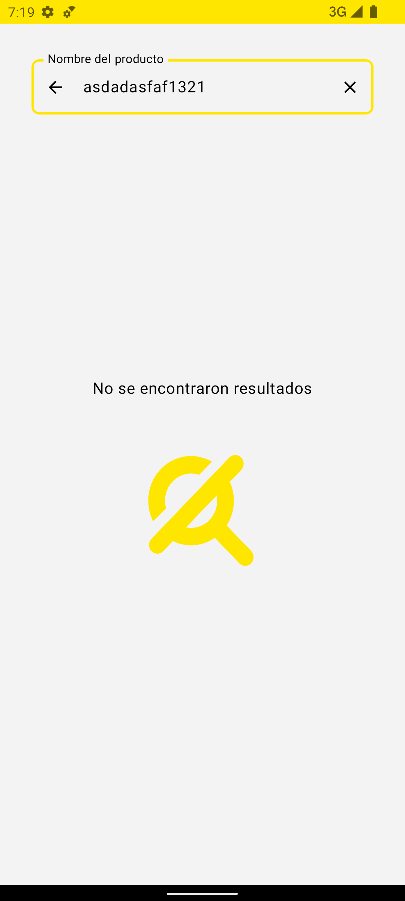

# MeliChallenge

Este proyecto forma parte de un desafío para Mercado Libre. Consiste en una aplicación diseñada para
buscar artículos, ver sus detalles y navegar al sitio web oficial para obtener más información.

# Apk
Descarga la última versión de la aplicación [aquí](https://github.com/SaulUrrea/MeliChallenge/blob/development/resultImages/app-meli.apk).

## UI

 |  |  | 
 |  |

## Características

- **Arquitectura limpia:** Implementa una arquitectura inspirada en Clean Architecture, dividiendo
  el proyecto en capas de dominio, repositorio, datos y UI. Esta separación en capas promueve la
  mantenibilidad, la escalabilidad y la facilidad de pruebas del código.
- **Desarrollado con Kotlin:** Utiliza las últimas versiones de Kotlin y Gradle con Kotlin para el
  manejo de dependencias, aprovechando las ventajas de un lenguaje moderno y seguro que mejora la
  productividad y la legibilidad del código.
- **Interfaz de usuario (UI) con Jetpack Compose:** Reemplaza el uso de XML con Jetpack Compose, la
  última tecnología en desarrollo de interfaces de usuario declarativas. Esto simplifica la
  construcción de UIs, haciéndolas más intuitivas y adaptables.
- **Llamadas HTTP con Retrofit:** Emplea Retrofit para manejar las llamadas HTTP de manera eficiente
  y sencilla, facilitando la interacción con APIs y la gestión de peticiones y respuestas.
- **Inyección de dependencias con Hilt:** Utiliza Hilt para la inyección de dependencias,
  simplificando la configuración de dependencias y mejorando la modularidad y testabilidad del
  código.
- **Gestión de dependencias con el Catálogo de Versiones:** Organiza las dependencias de las
  bibliotecas utilizando el Catálogo de Versiones, permitiendo una gestión centralizada y
  consistente de las versiones de las librerías.

## Estructura de Carpetas

- **core**: Contiene los componentes principales de la aplicación.
    - **application**: Incluye `@HiltAndroidApp` y la clase `CoreApplication`.
    - **di**: Módulos de inyección de dependencias para Aplicación, Dominio, Red y Repositorios.
- **data**: Capa de datos.
    - **apiservice**: Consumo de API para MercadoLibre.
    - **dto**: Objetos de transferencia de datos (DTO) para la respuesta de la API.
    - **repositories**: Repositorios de datos.
- **domain**: Capa de dominio.
    - **mapper**: Mapeadores que convierten DTO a modelos.
    - **models**: Modelos de datos del dominio.
    - **repositories**: Interfaces para los repositorios.
    - **usecases**: Casos de uso.
- **ui**: Capa de interfaz de usuario.
    - **navigation**: Configuración de la navegación.
    - **theme**: Configuración del tema de la aplicación.
    - **components**: Componentes de IU genéricos.
    - **home**: IU para la pantalla principal.
        - **models**: Modelos de IU.
        - **screens**: Pantallas.
        - **viewmodels**: Modelos de vista.
- **utils**: Funciones de utilidad.

## Pruebas

- Se realizaron pruebas unitarias.

- Se valida que las pruebas cumplan con cobertura del 100%

- Probado en dispositivos de varios tamaños de pantalla.

## Nota

Este proyecto está en desarrollo y puede recibir actualizaciones y mejoras.
